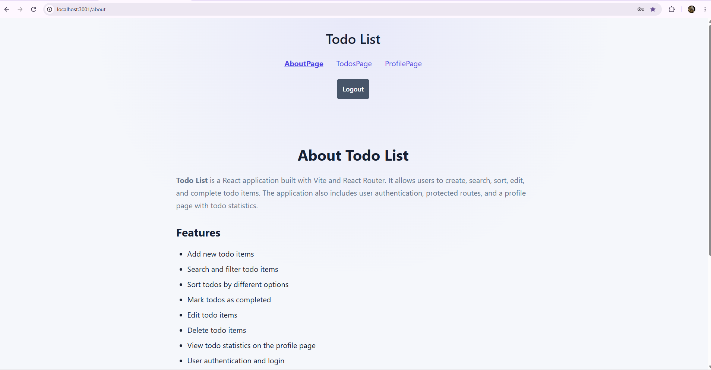
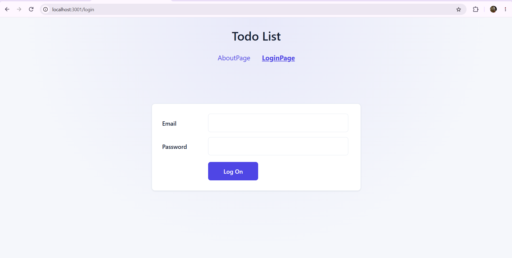
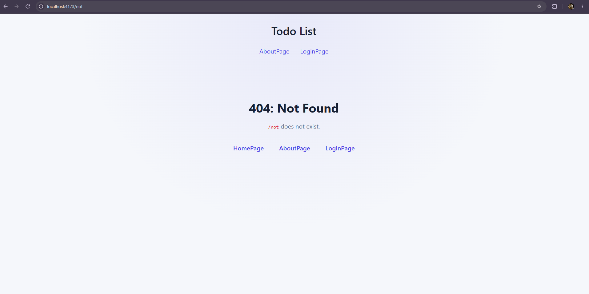
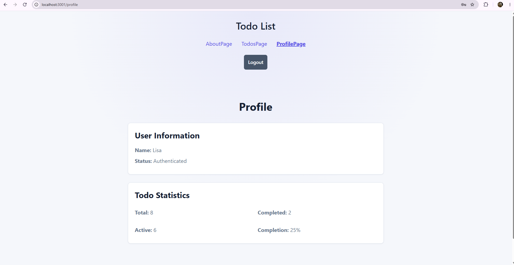
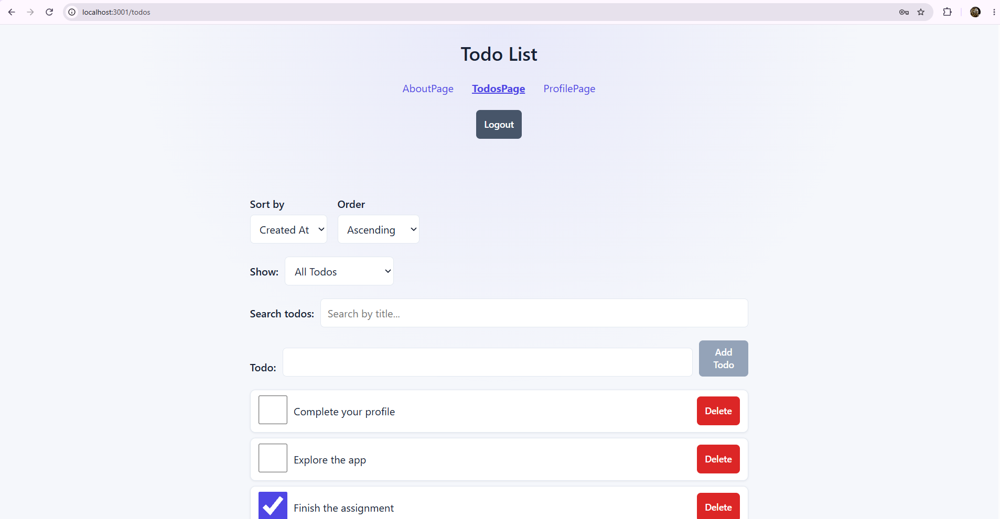
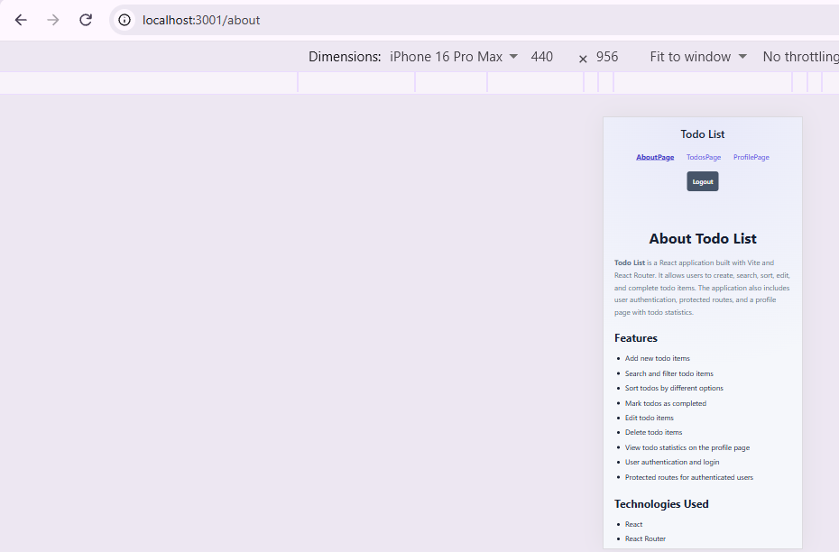
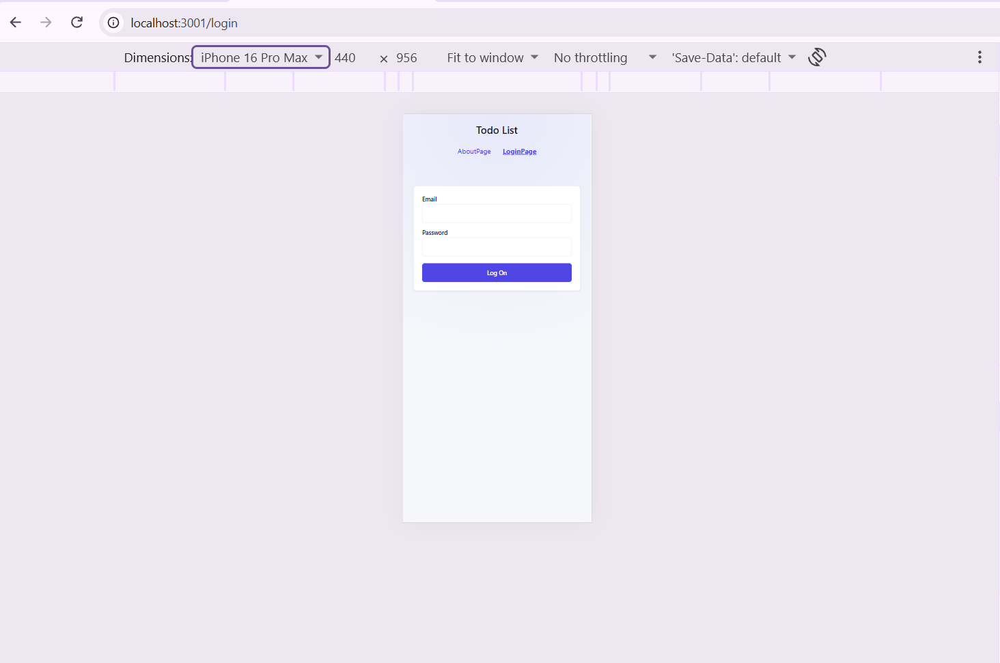
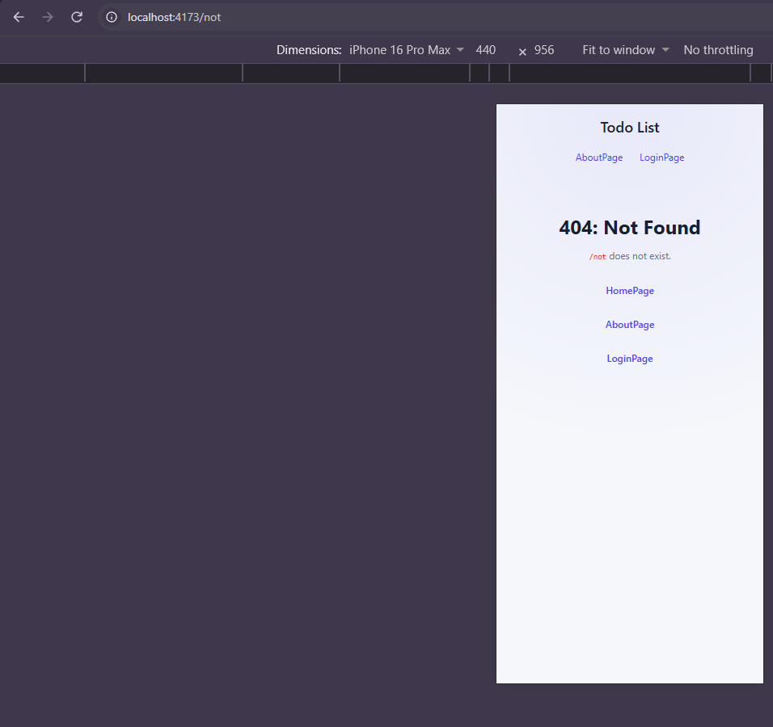
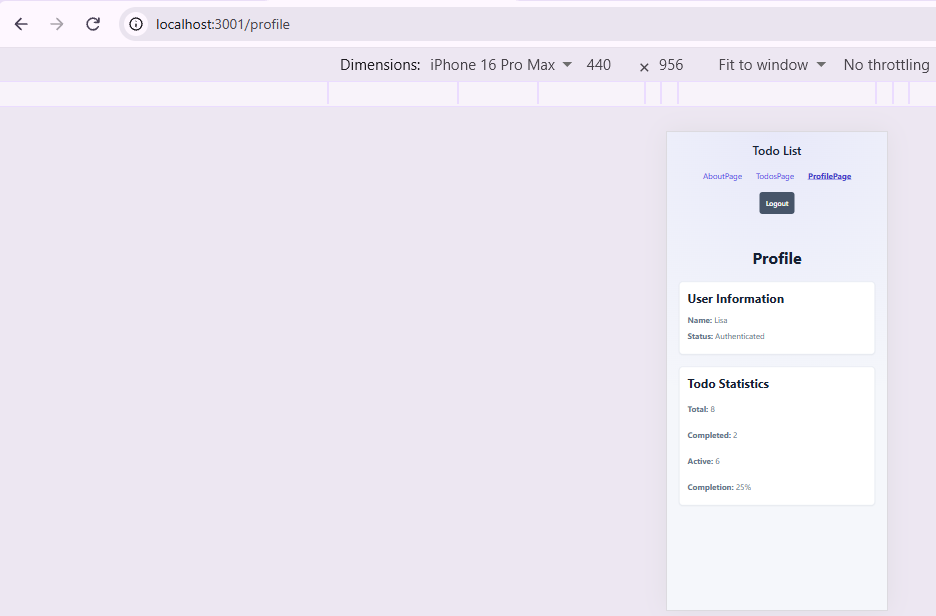
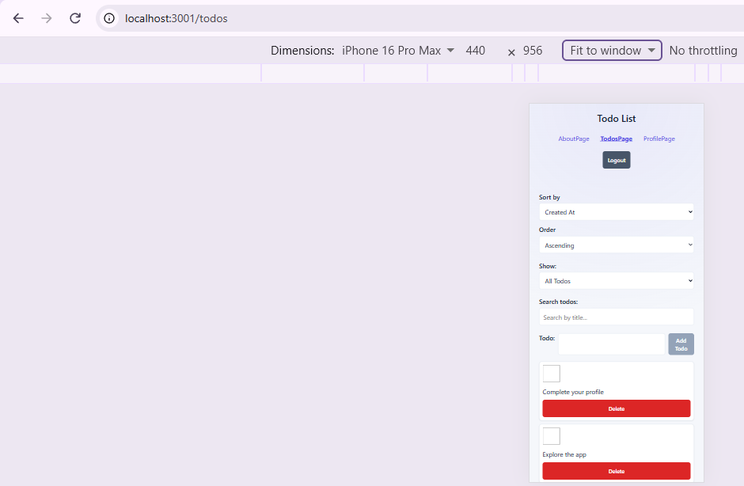

# Todo List

A responsive Todo List application built with React and Vite. The application helps users manage their tasks by allowing them to add, edit, complete, delete, filter, search, and sort todo items. It also includes user authentication, protected routes, client-side validation, todo statistics, and responsive styling for desktop, tablet, and mobile devices.

## 🚀 Live Demo

[View Live Application](https://todo-list-todo-list4.vercel.app/login)

## ✨ Features

- Add new todo items
- Edit existing todo items
- Mark todos as completed
- Delete todo items
- Search todo items
- Filter todos by status
- Sort todos using different options
- View todo statistics on the profile page
- User authentication and login
- Protected routes for authenticated users
- Client-side form validation
- Maximum 100-character todo title limit
- Loading and error states
- Responsive design for desktop, tablet, and mobile
- Touch-friendly controls and interactions

## 🛠️ Technologies Used

- **Frontend:** React 19
- **Routing:** React Router
- **Programming Language:** JavaScript
- **Styling:** CSS Modules
- **Build Tool:** Vite
- **Code Quality:** ESLint
- **Version Control:** Git and GitHub

## 📸 Screenshots

### Desktop Views

### Mobile Views

## 🏗️ Getting Started

### Prerequisites

Make sure you have the following installed:
- npm
- Git

### Installation

1. Clone the repository:

   git clone https://github.com/CTDLisaHoo/todo-list.git
   
2. Navigate to the project directory:

    cd todo-list
   
3. Install the project dependencies:

   npm install
   
### Running the Development Server

Start the development server by running:

npm run dev

Then open the local URL displayed in the terminal (typically `http://localhost:5173`) in your web browser.

## 📜 Available Scripts
Command	         Description
npm run dev	      Starts the Vite development server
npm run build	   Creates an optimized production build
npm run preview	Serves the production build locally for preview
npm run lint	   Runs ESLint to check the codebase for potential issues

## 🎨 Design Decisions
The application uses CSS Modules to keep component-specific styles scoped and reduce the possibility of naming conflicts between components.

Shared design values such as colors, spacing, borders, and shadows are managed using CSS variables to maintain visual consistency throughout the application.

The layout uses responsive CSS media queries to provide an optimized experience across desktop, tablet, and mobile screen sizes. Interactive controls include hover states, focus indicators, disabled states, and touch-friendly sizing to improve usability and accessibility.

Todo validation is centralized in utils/todoValidation.js, allowing the same validation rules to be reused when adding and editing todo items. This helps keep validation behavior consistent throughout the application.

## 🔮 Future Improvements
- Todo due dates and reminders
- Categories or tags for organizing todos
- Dark mode
- Automated unit and integration tests
- Improved authentication and account management
- Persistent cloud-based todo storage
- Todo priority levels
- Notifications and reminder settings

## 📄 License
This project is licensed under the MIT License.

## 📬 Contact
GitHub: https://github.com/CTDLisaHoo
